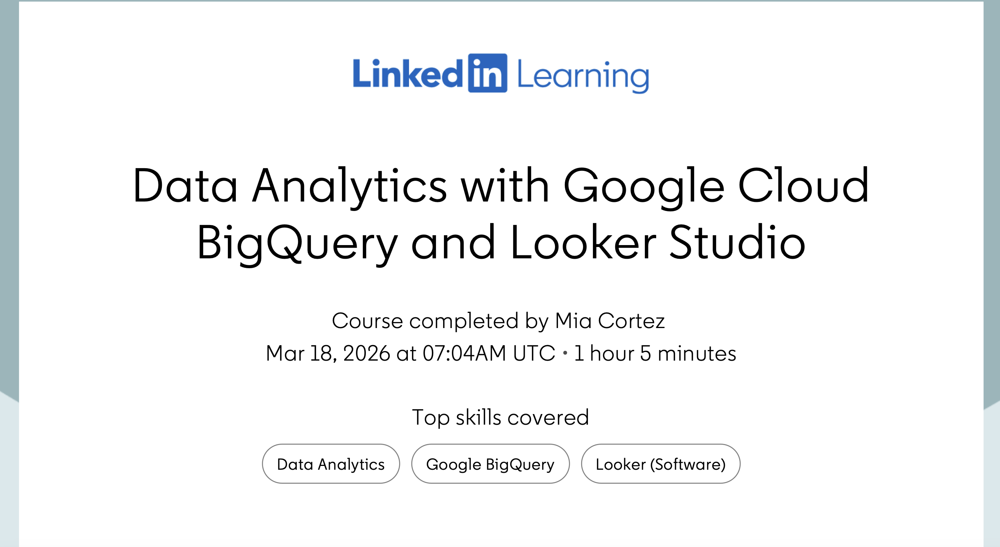

# Google Analytics, BigQuery, and Looker Studio

This project highlights my experience working with Google Analytics tools, BigQuery, SQL, and Looker Studio through IBM coursework.

These activities focused on analyzing datasets, organizing information, and creating visual reports to better understand data patterns and performance.

---

# BigQuery

BigQuery is a cloud-based data warehouse used for analyzing large datasets.

Through this project, I practiced:

- Running SQL queries
- Filtering and organizing data
- Aggregating information using COUNT and AVG
- Understanding how businesses analyze data at scale

---

# SQL and Data Transformation

I used SQL to clean, organize, and transform data.

Skills practiced included:

- Joins
- Filtering data
- Grouping data
- String functions
- Data summaries

---

# Looker Studio Visualization

Looker Studio was used to turn raw data into visual reports and dashboards.

Examples of visualizations created included:

- Line charts
- Bar charts
- Maps
- Performance summaries

---

# Key Takeaways

This project helped me better understand how analytics tools work together to support marketing and business decisions.

I learned how BigQuery can process large datasets efficiently while Looker Studio helps present information visually and clearly.

## Certification
 
